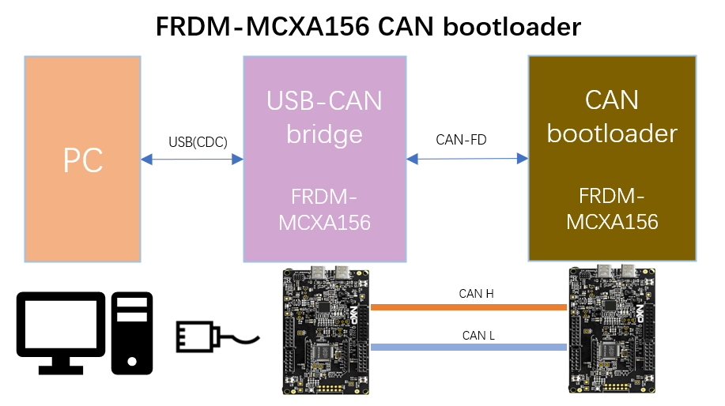
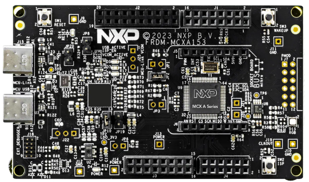
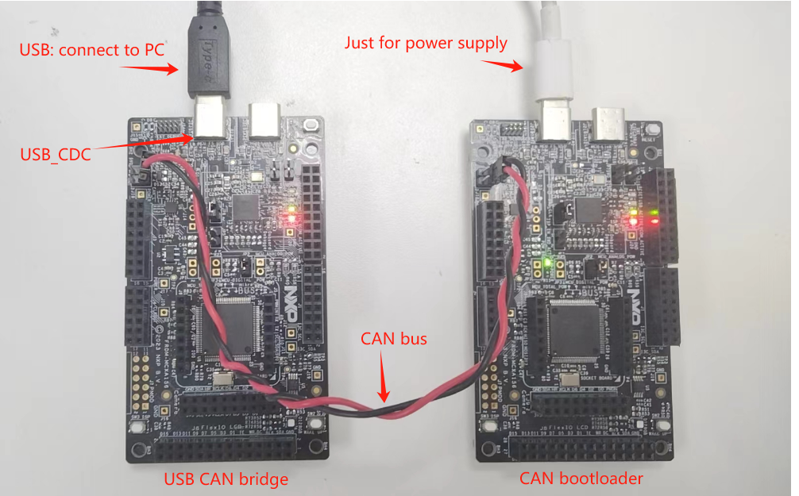
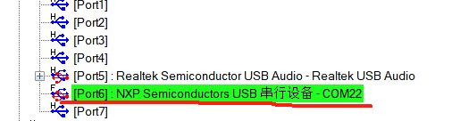

# NXP Application Code Hub
[](https://www.nxp.com)

## A simple CAN bootloader project for FRDM-MCXA156
A simple CAN bootloader project for FRDM-MCXA156

Updating the MCU firmware using CAN is a basic and commonly required task. This project employs two FRDM-MCXA156 boards to achieve firmware updates through the CAN bus and USB, with the basic architecture outlined below:



* **USB-CAN bridge**: This project utilizes the FRDM-MCXA156 hardware, connecting to a PC via USB. On the PC side, the USB port is enumerated as a CDC (Communication Device Class) virtual serial port(similar with SDK example: usb_device_cdc_vcom). This configuration allows the PC side to use tools like blhost to transmit data through the CDC virtual serial port to the USB-CAN bridge. The USB-CAN bridge then relays this data onto the CAN bus, facilitating transparent transmission between serial and CAN data.
* **CAN bootloader:** This project also uses the FRDM-MCXA156 hardware, functioning as a bootloader program. It is capable of receiving firmware data via the CAN bus and verifying the integrity of the new firmware. Upon successful verification, the system will transition to the application program.


#### Boards: FRDM-MCXA156
#### Categories: Tools
#### Peripherals: CAN
#### Toolchains: MDK

## Table of Contents
1. [Software](#step1)
2. [Hardware](#step2)
3. [Setup](#step3)
4. [Results](#step4)
5. [FAQs](#step5) 
6. [Support](#step6)
7. [Release Notes](#step7)

## 1. Software<a name="step1"></a>
This demo implements a straightforward CAN bootloader upgrade framework. It utilizes one FRDM-MCXA156 board as a USB-CAN bridge, facilitating data transmission between USB (as a CDC virtual serial port) and CAN-FD. Another FRDM-MCXA156 board serves as a CAN bootloader project, communicating with the USB-CAN bridge via CAN to receive data and update the application program.

Conditions for entering bootloader mode:

1. 1 second (can be configured ) after CAN bootloader code started.
2. Any valid NXP KBOOT protocol message is received by CAN bootloader.
3. When SW2(WAKEUP) pin is pressed when MCU reset.

Project classification and description:

| Project        | Path                        | Description                                                  |
| -------------- | --------------------------- | ------------------------------------------------------------ |
| usb_can_bridge | \frdmmcxa156\usb_can_bridge | Serves as the USB-CAN bridge, where USB is enumerated as a USB CDC port, modified from the SDK example usb_device_cdc_vcom |
| can_bootloader | \frdmmcxa156\can_bootloader | The CAN bootloader project, works in conjunction with the USB-CAN bridge |
| app_example    | \frdmmcxa156\app_example    | An example application for the CAN bootloader, with its start address changed from the default 0x0000_0000 to 0x00008000 (32K), differing only from the SDK's HelloWorld example in this respect. |

Default CAN bus configuration:

| Project        | CAN_FD Control Field Baud Rate | CAN_FD Data Field Baud Rate | CAN TX ID | CAN RX ID |
| -------------- | ------------------------------ | --------------------------- | --------- | --------- |
| usb_can_bridge | 500Kbps                        | 2Mbps                       | 0x09      | 0x08      |
| can_bootloader | 500Kbps                        | 2Mbps                       | 0x08      | 0x09      |

User can modify the default parameter such as CAN_TX, baud rate ,etc. in main.c

```
#define CAN_BIT_RATE                    (500*1000)
#define CAN_BIT_RATE_FD                 (2*1000*1000)
#define CAN_TX_ID                       (0x09)
#define CAN_RX_ID                       (0x08)
```

### Software Protocol

The communication protocol between CAN_bridge and CAN_Bootloader is very simple. Each CANFD frame transmits a fixed 64-byte payload, where the first 8 bytes are the control field (for compatibility with the UDS protocol), and bytes 8-64 are serial data. The first 8 bytes are defined as follows: 

* Byte 0-6: Reserved 
* Byte 7: Data field length: 1-56

Note that even if the data length is less than 56, the data field of each CANFD frame is fixed at 64 bytes. The extra part at the end will be automatically discarded.

## Hardware<a name="step2"></a>

*FRDM-MCXA156*



### Pin Table

Below is the pin usage in this project, it applies to both usb_can_bridge and can_bootloader project.

| Function    | GPIO     | Description                 |
| ----------- | -------- | --------------------------- |
| LPUART0_RXD | PORT0_2  | UART_RXD                    |
| LPUART0_TXD | PORT0_3  | UART_TXD                    |
| CAN0_TXD    | PORT1_13 | CAN bus transmission signal |
| CAN0_RXD    | PORT1_12 | CAN bus reception signal    |


## 3. Setup<a name="step3"></a>

Before getting started, you should:

* Be familiar with basic operations, such as downloading and debugging introductory examples like HelloWorld or led_blinky using the MCUX SDK. For more details, refer to: https://www.nxp.com/design/design-center/development-boards-and-designs/general-purpose-mcus/frdm-development-board-for-mcx-a14x-a15x-mcus:FRDM-MCXA153
* Understand the basic use of NXP's bootloader utility: blhost. For more information, refer to: https://www.nxp.com/design/design-center/software/development-software/mcuxpresso-software-and-tools-/mcu-bootloader-for-nxp-microcontrollers:MCUBOOT

### 3.1 Step 1

Connect your test environment as shown below:



The power supply for the CAN bootloader board can be connected to any PC capable of providing 5V.

### 3.2 Step 2

Flash the usb_can_bridge and can_bootloader projects onto two boards respectively, compile the app_example project to generate app_example.hex. Put the hex file in the same folder as your blhost software.

### 3.3 Step 3

* Insert the USB cable into the USB-CAN-bridge board's J23 (MCU FS USB) and press the reset button. The PC should enumerate a USB-CDC serial port and pop up the corresponding COM port. If the USB is not recognized correctly, you can verify your software and hardware setup using the SDK's example: boards\frdmmcxa156\usb_examples\usb_device_cdc_vcom.。



* Insert the USB cable into the CAN bootloader board's J21 (MCU-Link USB), though connecting it to J23 is also feasible. This USB port is solely for powering the board.。

### 3.4 Step 4

Connect both boards' CAN_H and CAN_L with twisted pair cables, as shown in the diagram above.

### 3.5 Step 5

Hold down SW2 (WAKEUP) on the CAN bootloader board. Then press SW1 (RESET), and the CAN bootloader will enter boot mode. Open a command line and enter:

```bash
$ ./blhost.exe -p COM22 get-property 1
```

If you receive the following response, it indicates that the hardware connection is normal and blhost has successfully connected to the CAN bootloader:

```bash
Ping responded in 1 attempt(s)
Inject command 'get-property'
Response status = 0 (0x0) Success.
Response word 1 = 1258357760 (0x4b010400)
Current Version = K1.4.0
```

### 3.6 Step 6

Enter the flash-image command, followed by the path to your compiled app_example.hex file. This command will erase the Flash where the app resides and write the new hex firmware into Flash.

```bash
$ ./blhost.exe -p COM22 -- flash-image app_example.hex erase
```

If everything goes as planned, you should see a response like this:

```bash
Ping responded in 1 attempt(s)
Inject command 'flash-image'
Successful generic response to command 'flash-erase-region'
Wrote 7340 bytes to address 0x8000
Successful generic response to command 'write-memory'
(1/1)100% Completed!
Successful generic response to command 'write-memory'
Response status = 0 (0x0) Success.
```


## 4. Results<a name="step4"></a>
Reset the CAN bootloader board; its LED will blink. If you check the serial log output of the board, it will display messages like:

```bash
MCXA CAN bootloader
APP ADDR:0x8000
TIMEOUT!, JUMP!
jump to 0x    8000
I AM MCX APP EXAMPLE APP
MAIN ADDRESS:0x98B5
LED Toggle!
LED Toggle!
LED Toggle!
...

```

Full list of blhost commands and logs:

```bash
$ ./blhost.exe -p COM22 get-property 1
Ping responded in 1 attempt(s)
Inject command 'get-property'
Response status = 0 (0x0) Success.
Response word 1 = 1258357760 (0x4b010400)
Current Version = K1.4.0

$ ./blhost.exe -p COM22 -- flash-image app_example.hex erase
Ping responded in 1 attempt(s)
Inject command 'flash-image'
Successful generic response to command 'flash-erase-region'
Wrote 7320 bytes to address 0x8000
Successful generic response to command 'write-memory'
(1/1)100% Completed!
Successful generic response to command 'write-memory'
Response status = 0 (0x0) Success.

$ ./blhost.exe -p COM22 reset
Ping responded in 1 attempt(s)
Inject command 'reset'
Successful generic response to command 'reset'
Response status = 0 (0x0) Success.
```


## . FAQs<a name="step5"></a>

* Why not use BootROM's built-in CAN interface and instead implement a new CAN bootloader?

  The CAN protocol provided by BootROM is not fully described in official documentation, and it requires a tool called BusPal for serial-to-CAN conversion. From both a software and hardware architecture perspective as well as customer customization, this is not very practical.

* Does this demo consider reliable updates or security aspects?

  No, this demo aims to provide customers with a proof-of-concept for a CAN bootloader implementation without considering any "advanced" features.

## 6. Support<a name="step6"></a>


#### Project Metadata
<!----- Boards ----->
[](https://github.com/search?q=org%3Anxp-appcodehub+FRDM-MCXA156+in%3Areadme&type=Repositories)

<!----- Categories ----->
[](https://github.com/search?q=org%3Anxp-appcodehub+tools+in%3Areadme&type=Repositories)

<!----- Peripherals ----->
[](https://github.com/search?q=org%3Anxp-appcodehub+can+in%3Areadme&type=Repositories)

<!----- Toolchains ----->
[](https://github.com/search?q=org%3Anxp-appcodehub+mdk+in%3Areadme&type=Repositories)

Questions regarding the content/correctness of this example can be entered as Issues within this GitHub repository.

>**Warning**: For more general technical questions regarding NXP Microcontrollers and the difference in expected funcionality, enter your questions on the [NXP Community Forum](https://community.nxp.com/)

[](https://www.youtube.com/@NXP_Semiconductors)
[](https://www.linkedin.com/company/nxp-semiconductors)
[](https://www.facebook.com/nxpsemi/)
[](https://twitter.com/NXP)

## 7. Release Notes<a name="step7"></a>
| Version | Description / Update                           | Date                        |
|:-------:|------------------------------------------------|----------------------------:|
| 1.0     | Initial release on Application Code Hub        | April 2<sup>nd</sup> 2024 |

